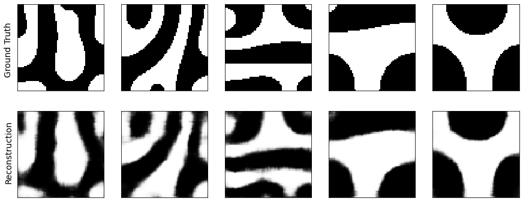
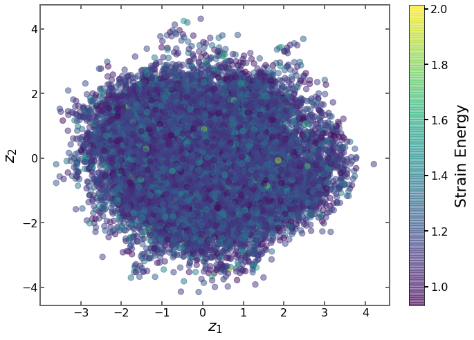

# Variational Autoencoder (VAE) with Mechanical MNIST

## Goal
This repository consists of example code for the implementation of one of the common generative model architectures: Variational Autoencoder (VAE) for a material science problem. VAEs represent each datapoint as probability distribution and embedds the meanningful relations in low-dimensional latent space. These models can be used to perform inverse materials design, which means it is possible to predict structure or processing parameters for given target material properties.

In this materials design example, VAE was implemented by using the [Mechanical MNIST (Cahn-Hilliard) Dataset](https://github.com/elejeune11/Mechanical-MNIST-Cahn-Hilliard).

## Methodology
When the model is trained with the dataset consisting of microstructure images of the material, the model extracts the most important features in each microstrcuture and represent these feature by its design space. This design space is actually known as "latent space" in computer science terminology. 
The extrapolation in latent space was performed by randomly choosing microstructures and tailoring each latent space axis.

## Works to do
Interpolation and extrapolation in latent space will be performed.

## Additional Notes

The code was written on Google Colab platform. Different installation of libraries or functions might be required to use the notebook in local machines.

