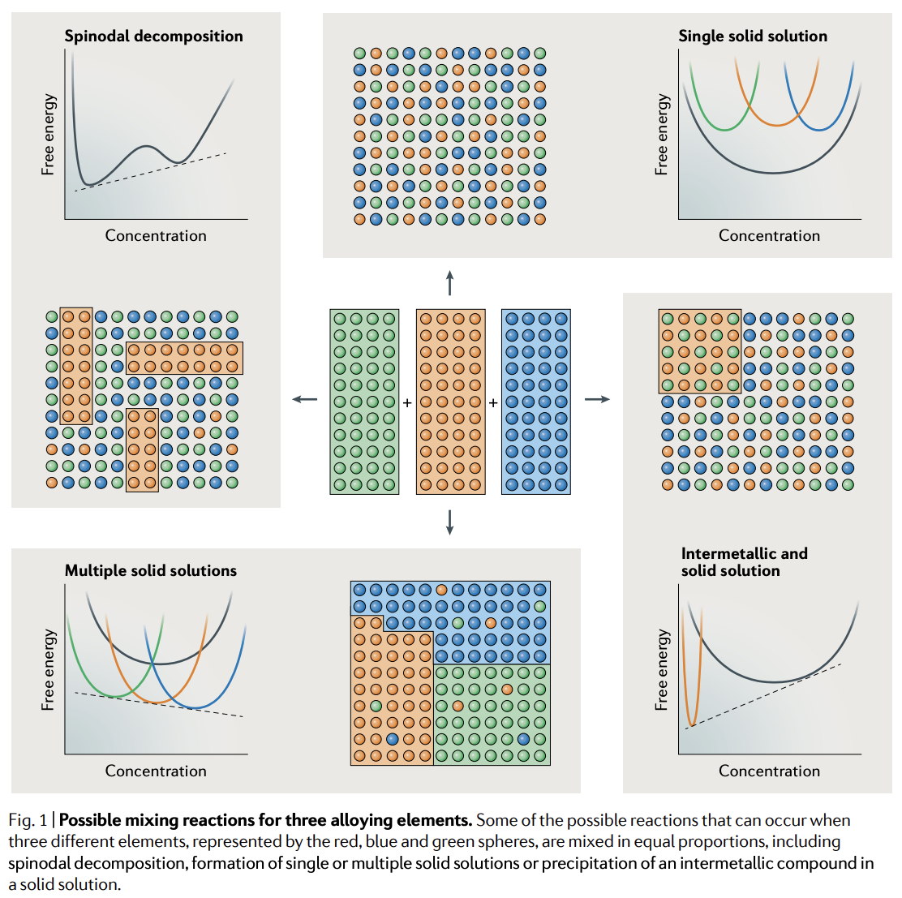
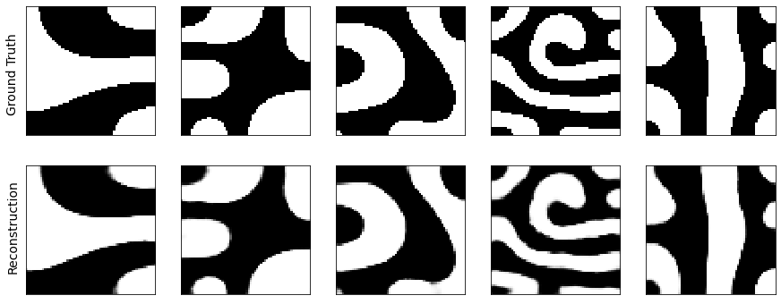
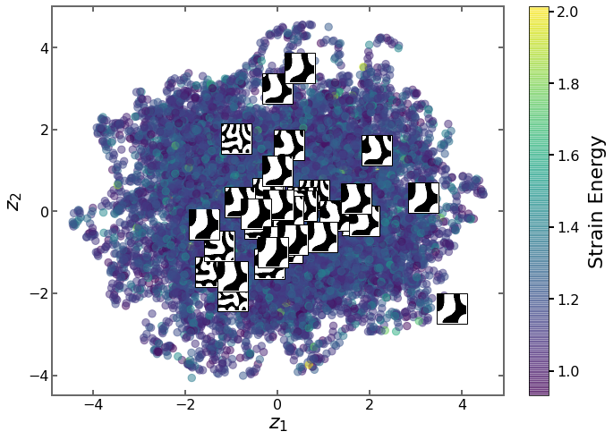

# Variational Autoencoder (VAE) with Mechanical MNIST (Cahn-Hilliard)

## Goal
This repository consists of a notebook for the implementation of one of the common generative model architectures: Variational Autoencoder (VAE) in material science domain. VAEs represent each datapoint as probability distribution and embeds the meaningful relations between the datapoints in the low-dimensional latent space. These models can be used to perform inverse materials design, which enables to predict the structure or the processing parameters for given target material properties.

In this example, VAE was implemented by using the [Mechanical MNIST (Cahn-Hilliard) Dataset](https://github.com/elejeune11/Mechanical-MNIST-Cahn-Hilliard).
This dataset consists of 2D microstructures generated by Cahn-Hilliard (CH) equation and their strain energy obtained from finite element simulations. HC equation is a fourth-order partial differential equation used in phase-field modeling of microstructure evolution during phase transformations of binary or ternary alloys ([Original paper](https://aip.scitation.org/doi/pdf/10.1063/1.1744102) by Cahn & Hilliard, [this paper](https://www.aimspress.com/article/doi/10.3934/era.2022143) and [this paper](https://www.sciencedirect.com/science/article/pii/S0927025613004801 can be good sources to read for detailed information about CH). Spinodal decomposition is one the examples for which  CH equation can be used to define the formed phases. The schematic at top-left in the figure below represents the free energy curve and atomic distribution for a ternary alloy.

By using this dataset, I aimed to (1) predict necessary phase distribution/microstructure for a given strength/mechanical behavior and (2) to estimate the prior and posterior microstructures of a known microstructure during phase separation.

## Methodology
When the model is trained with the dataset consisting of microstructure images of the material, the model extracts the most important features in each microstructure and represent these features in its design space, which is also known as "latent space". By using the embedded information of the microstructures in this design space, model can design necessary microstructures to achieve target mechanical behavior.

## Works to do
Interpolation and extrapolation in latent space will be performed.

## Additional Notes

The code was written on Google Colab platform. Different installation of libraries or functions might be required to use the notebook in local machines.

